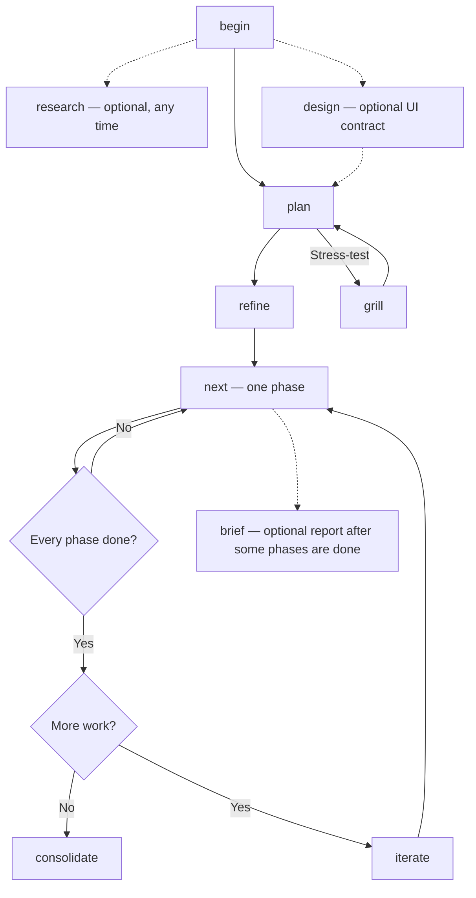
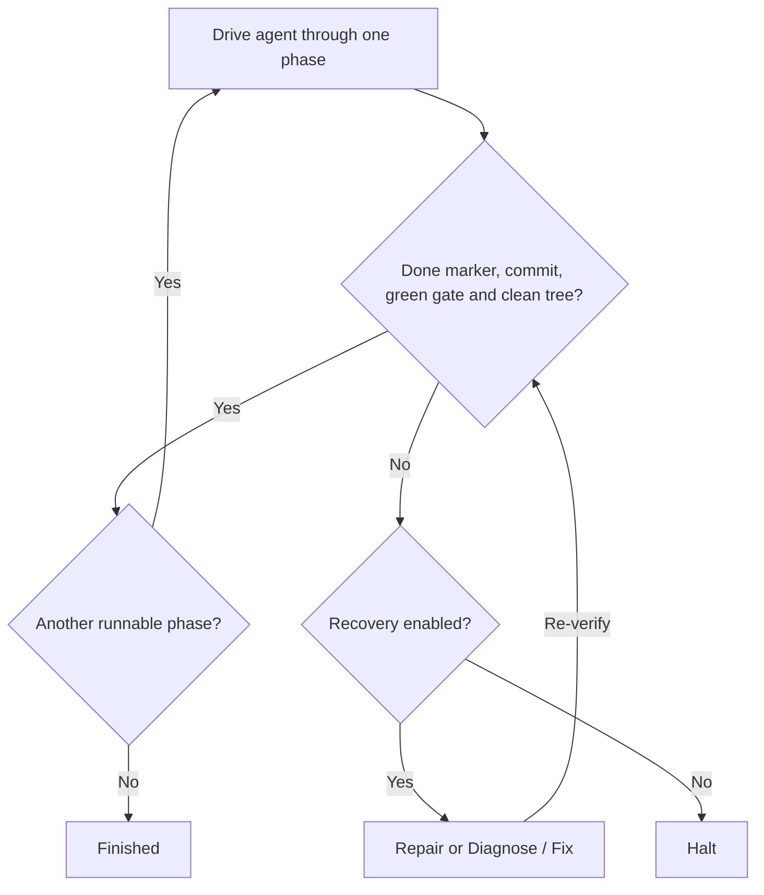

## Prerequisites

- **junji skill** installed: `npx skills add getkoi/koi`
- **`koi setup`** run once per repo (durable project home), then **`koi init`** (or you accept cold `begin` without driver config yet)
- A **source doc** or rough idea for `plan` (RFC, ADR, PRD, ticket prose)
- Repo root as the anchor: paths are always repo-root-relative; never create `phases/` or `BACKLOG.md` at the repo root or `.koi/` root

## Outcome

A git-committed `.koi/run/` working folder with:

- Stable **PLAN.md** (strategy) and **CONTEXT.md** (execution contract)
- Optional **DESIGN.md** (visual / experiential contract) when the run ships human-facing surfaces
- An ordered **phase list** in **BACKLOG.md**
- Runnable **sensors** under `.koi/sensors/`
- Phases executed one at a time via `next` (or `yokai`). After every phase is `[done]`, **iterate** can grill more work onto the backlog, or **consolidate** collapses `run/` into a repo-native deliverable

## The verb pipeline



`begin` gathers facts only. Optional `research` and `design` gather cited notes and a visual contract.
`plan` and `grill` think. Optional `brief` reports in chat what `[done]` phases shipped. `refine` shapes markdown. `next` executes **one** phase. `iterate` is optional after every phase is `[done]`.

---

## `begin`: scaffold + survey

**Prerequisites:** None (idempotent after `koi setup` + `koi init` or cold).

**Steps:**

1. In the agent: `/junji begin`
2. Skill copies `METHOD.md` and `BACKLOG.md` from templates (byte-identical; Next action already `/junji plan`). Copies the CONTEXT skeleton if missing or still the init stub. Empty `phases/`.
3. Surveys the repo for observable facts only: file map, toolchain commands, spec conventions, **Skill scout** (`CONTEXT.md › Skills`: Must from `AGENTS.md` / `DESIGN.md` / siblings, catalog of in-repo `SKILL.md`, by-role index). **No load-bearing decisions.** The agent authors CONTEXT only.
4. Leaves `.koi/run/config.yml` and existing `.koi/sensors/*.sh` untouched

**Verification:** `BACKLOG.md` shows `Next action: /junji plan`. No `PLAN.md` yet. Skills section is filled (`none` is valid).

**Failure:** Files at wrong paths (repo root or `.koi/` root). Delete them and re-run `begin`.

---

## `research`: optional cited notes

**Prerequisites:** Working folder exists.

**Steps:**

1. `/junji research "question one?" "question two?"`
2. One cited note per question under `.koi/run/researches/NN-<slug>.md` from primary sources

**Verification:** Notes on disk; **Next action unchanged**.

Use before `plan`/`grill` when facts must be pinned to sources. Distinct from **phase research** inside `next` (reads files named by the phase plan).

---

## `design`: optional visual contract

**Prerequisites:** Working folder exists.

**Steps:**

1. `/junji design` with reference URLs/paths, a source doc or prompt, and/or the project `DESIGN.md`
2. Follow `CONTEXT.md › Skills` Must rows for `design` (or a design-flavored Available skill if none). Research notes under `.koi/run/designs/NN-<slug>.md`; analyse directions; grill if visual direction or which skill is unsettled; consolidate binding `.koi/run/DESIGN.md`
3. Updates `CONTEXT.md › Design contract` to point at the run file (inherits project design doc when present; never overwrites it)

**Verification:** `.koi/run/DESIGN.md` on disk; **Next action unchanged**.

`plan` may activate this when the work is human-facing and `DESIGN.md` is missing. `iterate` may too. `next` obeys it for UI phases and follows Skills Must rows whose *when* matches the phase.

---

## `plan`: strategy + verification bar

**Prerequisites:** `begin` done; user points at a source doc or idea.

**Steps:**

1. `/junji plan` (with the source doc in context)
2. Read `researches/` and `DESIGN.md` when present; if human-facing work and no `DESIGN.md`, run/ask for `design` first
3. Reason, then **grill** (frontier rounds) until decisions are solid
4. Write `.koi/run/PLAN.md`: problem, approach, decisions, **with rationale**, success criteria
5. Move binding facts into `.koi/run/CONTEXT.md`: locked decisions, verification bar, deliverable spec model, standing overrides
6. Create **sensors**: if `.koi/sensors/` has no `*.sh`, write one atomic script per bar concern; if scripts exist, mirror them into CONTEXT prose (no silent overwrite)

**Verification:** Verification bar in CONTEXT matches `.koi/sensors/*.sh`. `Next action: /junji refine`.

**Failure:** Judgment-call "bar" with no exit-code commands. Rewrite it as automatable sensors: the project's real stack gates (fmt/lint/typecheck/tests), not a bespoke growing assertion script.

---

## `grill`: sharpen on demand

**Prerequisites:** `PLAN.md` exists.

**Steps:**

1. `/junji grill` when terminology or decisions feel soft
2. Frontier rounds: numbered questions, recommended answers, wait for confirmation
3. New terms → CONTEXT › Language; new decisions → PLAN (rationale) + CONTEXT (terse fact); visual decisions → `DESIGN.md` when that contract exists

**Verification:** Updated PLAN/CONTEXT (and DESIGN.md if visual); **Next action unchanged**.

---

## `brief`: chat-only product briefing

**Prerequisites:** Working folder exists; at least one phase `[done]`.

**Steps:**

1. `/junji brief` when you need to show a user or reviewer what works now
2. Reads `[done]` Outcomes, CONTEXT (run/test commands), carry-forward, and `DESIGN.md` when present. Writes nothing.
3. Chat: `N of M landed` + Next action, then Shipped / Use · Check / Watch in plain language

**Verification:** **Next action unchanged**. No new files.

Useful after some phases have landed. If nothing is `[done]`, it stops. Distinct from `METHOD.md` › Report (one phase) and from `consolidate` (writes the deliverable).

---

## `refine`: phase list

**Prerequisites:** `PLAN.md` and filled `CONTEXT.md`.

**Steps:**

1. `/junji refine`. First run decomposes; later runs split/merge/reorder a *live* list.
2. Each phase is one **independently-verifiable** unit, ordered by dependency.
3. Irreversible steps → prefix `[gated]`.
4. Select strategy: `[plain]` or `[swarm]` on every heading (default `[plain]`; `[swarm]` only when the
   phase is one bar whose work is the same step across many independently mergeable items).
5. Select tier: `[low]` `[medium]` `[high]` `[ultra]` after strategy (default **medium**; low only if
   mechanical; ultra only if it is the hardest unsplittable work in the plan).
6. Writes phase list to `BACKLOG.md` only. No code, no `phases/` plans yet.

**Verification:** Ordered list; every heading has strategy and tier; `Next action: /junji next`. Chat: `Strategy selected.` plus each phase with both tags.

Once every phase is `[done]`, `refine` does not add work: use `iterate`.

---

## `next`: one phase end-to-end

**Prerequisites:** Phase list in `BACKLOG.md`; gate scripts present.

A backlog heading looks like `### [plain] [medium] [todo] P0 - Title`.

- `[plain]` selects one coder. `[swarm]` allows Yokai to fan out when swarms are enabled.
- `[medium]` is the capability tier. The refine rubric can choose `[low]`, `[high]`, or `[ultra]` instead.
- `[todo]` is the status. Work moves through `[planning]`, `[building]`, `[sealing]`, and `[done]`.
- An optional `[gated]` prefix marks a phase that needs human pre-authorization.

Interactive `next` preserves these tags and does not switch the agent or model.

**Steps (same every run):**

```
1 load       read CONTEXT + BACKLOG; pick first_runnable (in-flight tag else `[todo]`; halt on `[gated]` unless pre-authorized)
2 research   read files the phase will touch; study idioms for this slice
3 plan       write .koi/run/phases/phase-NN-<slug>.md unless that file already exists
4 implement  scoped to this phase only
5 verify     run every .koi/sensors/*.sh — all exit 0
6 compact    `[sealing]` then `[done]`; Outcome on phase plan; carry-forward; update Next action
7 commit     one conventional commit; honor standing overrides (e.g. never push)
```

Invoke: `/junji next` or "do the next task". The **yokai driver** splits this into Plan → Build → Seal. See [Build](/docs/yokai/build).

**Verification:** Phase `[done]`, gate green, one new commit, clean tree (driver contract).

**Failure:**

- Red gate → fix root cause; never weaken sensors
- `[gated]` → human decision, or `yokai` without `--guarded`
- Started two phases in one run → violation; only one phase per `next`

**Next action:** `/junji next` while `[todo]` or in-flight remain; else `/junji consolidate` (or `/junji iterate <request>` to add more work).

---

## `iterate`: more work after the backlog is done

**Prerequisites:** Every phase `[done]`. `PLAN.md` exists. A request (what to change).

**Steps:**

1. `/junji iterate` with the request. Missing request → the skill asks in one line and stops.
2. Reason, then **grill** until the frontier is empty: including how many phases, boundaries, `depends_on`, `[gated]`, `[plain]` / `[swarm]`, and `[low]` / `[medium]` / `[high]` / `[ultra]`.
3. **Select strategy and tier** for each new phase (defaults `[plain]` `[medium]`; same rubrics as refine). Write BACKLOG headings continuing `P{n+1}` **with both tags** (`### [plain] [medium] [todo] PN - …`) **and** a full `phases/phase-NN-<slug>.md` for each. No product code.
4. Commit those working-folder artifacts (honor standing overrides). `Next action: /junji next`. Chat: `Strategy selected.` plus each new phase with both tags.

**Verification:** New `[todo]` phases each tagged `[plain]` or `[swarm]` and a tier, matching phase files; pointer is `/junji next`. Then `next` or `yokai` (yokai skips Plan because the files exist).

**Failure:**

- Any phase not yet `[done]` → refuse; finish the live list first
- Called `refine` instead → `refine` redirects here once the list is all `[done]`

Repeat as needed: iterate → next ↺ → iterate …

---

## `consolidate`: deliverable + remove run/

**Prerequisites:** Every phase `[done]`.

**Steps:**

1. `/junji consolidate`
2. Rewrite the build log into the repo's native spec home (per CONTEXT › Deliverable spec model)
3. `git rm -r .koi/run/` in one commit. **Project home** (`sensors/`, `sandbox.yml`) stays.

**Verification:** Deliverable on disk; `.koi/run/` gone; history retains phases.

This step is destructive by design. Git history is the archive.

---

## PLAN vs CONTEXT

| | **PLAN.md** | **CONTEXT.md** |
|---|-------------|----------------|
| Audience | Human understanding | Fresh execution window |
| Holds | Why, rationale, success criteria | Locked facts, **verification bar**, overrides |
| Read by `next`? | No | **Always** |

When a decision moves, update both: rationale in PLAN, binding fact in CONTEXT.

---

## Running unattended

When sensors and phases are reliable, **yokai** loops without a human:



Yokai checks the results against your sensors and git history. Define a verification bar that tests the behavior you need before starting an unattended run.

---

## Cheat sheet

| Question | Answer |
|----------|--------|
| Where do I start? | [Quickstart](/docs/start-here/quickstart): `koi setup`, `koi init`, `/junji begin` |
| What are we doing? | `/junji plan` |
| Turn plan into tasks? | `/junji refine` |
| Do one slice? | `/junji next` or `yokai` |
| What shipped / how to run? | `/junji brief` |
| Want another slice after everything is `[done]`? | `/junji iterate` |
| Which step am I on? | `BACKLOG.md` › Next action |
| Done? | `/junji consolidate` |

## Next

- [Skills reference](/docs/junji/skills): junji vs yokai skill, sensor wiring
- [Sensors](/docs/sensors): gate semantics
- [yokai run](/docs/yokai/run): driver flags and contract details
- Verb specs: [skills/junji/verbs/](https://github.com/getkoi/koi/tree/main/skills/junji/verbs)
