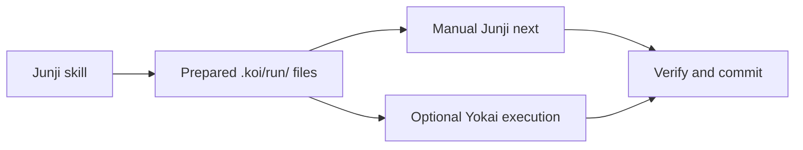

Koi is the product umbrella and documented `.koi/` convention for engineering work that spans agent
sessions. Junji is the free method. Yokai optionally drives prepared work and verifies it on disk.
There is no Koi executable and no shared bootstrap layer to install.

## Choose an entry point

**Junji alone:** install the skill and run `/junji begin`. Plan and refine the effort, then use `next`
to implement, run the documented verification commands and commit each phase. Sensor scripts and runtime
model choices are optional. [Start with Junji](/koi/docs/quickstart#junji-alone).

**Junji-prepared work with Yokai:** run `yokai` in the prepared repository. Interactive startup handles
missing settings and reviewed gate preparation, then offers to start. Saved settings carry across
efforts. [Add Yokai](/koi/docs/quickstart#add-yokai-to-a-prepared-project).

The filesystem is durable memory. A new session reads CONTEXT, METHOD and BACKLOG to recover the
binding facts, execution protocol and position. Yokai can consume these files without the skill installed.
It does not accept a raw goal or replace Junji's planning work.

## What survives an effort

`.koi/run/` contains method documents, optional effort overrides, sessions, recovery and accounting.
`consolidate` removes the entire folder after all phases finish and the human authorizes the collapse.
The rest of `.koi/` survives: reusable Yokai settings, optional sensors, reviewed gate and sandbox recipe.

Both paths preserve human gates, dependency order and standing directives. Importing a plan or reviewing
sensors never approves gated actions. [Project home](/koi/docs/project-home).

## Continue reading

- [Quickstart](/koi/docs/quickstart): method first, optional automation.
- [Junji guide](/junji/docs/guide): all ten verbs.
- [Yokai run guide](/yokai/docs/run): runtime and diagnostics.
- [Settings and migration](/yokai/docs/configuration): durable preferences and effort differences.
- [Migration from the Koi CLI](/koi/docs/cli): preserve existing work.
- [Sensors](/yokai/docs/sensors) and [sandbox](/yokai/docs/sandbox): optional runtime infrastructure.
