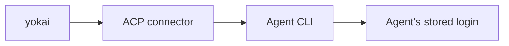

Derived from the Rust CLIs in `crates/koi` and `crates/yokai`.
Practical walkthrough: [Quickstart](/docs/start-here/quickstart). On-disk settings: [configuration](/docs/reference/configuration).

Shared defaults unless overridden:

- `--working-folder` → `.koi/run`
- `--repo` → `.` (git repo the agent works in)

## `koi`

Product setup CLI: project-home scaffold, config wizard, and preflight. The phase runner is **`yokai`**.

```bash
koi setup [OPTIONS]
koi init [OPTIONS]
koi doctor [OPTIONS]
```

### `koi setup`

Owns the durable **project home** `.koi/`. Run once per repo
([ADR-0032](https://github.com/getkoi/koi/blob/main/crates/yokai/docs/adr/0032-koi-setup-owns-project-home.md)).
It creates `.koi/sensors/` with a README pointer, but no sensor scripts. Use the yokai skill or `/junji plan` to write them. It writes `.koi/sandbox.yml` (enabled / backend / image),
scaffolds `.koi/Dockerfile.sandbox` write-if-absent when sandbox is enabled, and ensures the managed
`.gitignore` block. The TTY wizard runs Sandbox → Backend → Image → Confirm.

It never initiates a run and never spawns a model fetch.

| Flag | Description |
|------|-------------|
| `--project-home <path>` | Default: `.koi` |
| `--repo <path>` | Default: `.` |
| `--yes` | Skip wizard; write resolved values (also implied with no TTY) |
| `--sandbox <on\|off>` | Sandbox declaration in `sandbox.yml` |
| `--backend <docker\|apple>` | Sandbox backend |
| `--image <tag>` | OCI image tag in `sandbox.yml` |
| `--agent <name>` | Steers the Dockerfile recipe only. The driver agent lives in `koi init`. |

### `koi init`

Writes the volatile **working folder** `.koi/run/` only: `config.yml` (including `tiers:`, `build:`, and
optional `swarm:`) and a `CONTEXT.md` stub (if absent). Run once per effort. It does not write `.koi/sandbox.yml` or
`Dockerfile.sandbox`; that is `koi setup`. It also does not scaffold junji markdown; use
`/junji begin` for that. It still ensures the `.gitignore` block as a safety net, and prints a hint to
run `koi setup` when the project home is not set up.

Choose an agent, then select candidates for each capability band: Low, Medium, High, and Ultra. Press Space to toggle a candidate. You can switch agents within a band to mix providers. Each band starts with the previous band's choices and must contain at least one candidate. Then configure permissions, Build, recovery, swarms, and optional role tiers.

| Flag | Description |
|------|-------------|
| `--working-folder <path>` | Default: `.koi/run` |
| `--repo <path>` | Default: `.` |
| `--yes` | Skip wizard; stamp `--agent` / `--model` / `--effort` onto all four bands (also implied with no TTY) |
| `--agent <name>` | `claude` \| `cursor` \| `opencode` \| `codex` (browse source; `--yes` stamp) |
| `--model <id>` | Opaque model id (`--yes` stamp) |
| `--effort <level>` | Opaque ThoughtLevel alias (`--yes` stamp; skipped if agent has none) |
| `--permission <mode>` | `approve-all` \| `approve-reads` \| `deny-all` |
| `--max-iters <n>` | Build iteration budget (`config.yml` `build.max_iters`) |

### `koi doctor`

Structural checks (tools, git repo, working folder, backlog) plus auth and sensor hints. Empty sensors
are a warning; the supervisor still fails closed before the first phase turn. Missing or empty `tiers:`
is a Fail (`re-run koi init`). Doctor exits `1` when a required check fails.

| Flag | Description |
|------|-------------|
| `--working-folder <path>` | Default: `.koi/run` |
| `--repo <path>` | Default: `.` |
| `--agent <name>` | Override agent for auth checks |
| `--probe` | Live auth round-trip (+ sandbox in-VM checks when enabled) |

## `yokai`

Fail-fast junji phase driver. Settings: flag → `config.yml` / `sandbox.yml` → default.

```bash
yokai [OPTIONS]
```

| Flag | Config file | Default / notes |
|------|-------------|-----------------|
| `--working-folder <path>` | — | `.koi/run` |
| `--repo <path>` | — | `.` |
| `--agent <name>` | `config.yml` `tiers:` | pin this launch (skip the candidate walk) |
| `--model <id>` | `config.yml` `tiers:` | pin this launch (skip the candidate walk) |
| `--effort <level>` | `config.yml` `tiers:` | pin this launch (skip the candidate walk) |
| `--permission <mode>` | `config.yml` | `approve-all` |
| `--max-iters <n>` | `config.yml` `build.max_iters` | omitted = unlimited |
| `--token-savings` | `config.yml` `token_savings` | reuse planning/implementation, review, and seal sessions per phase; require review; prohibit swarms |
| `--guarded` | — | Halt at each `[gated]` phase (bare `yokai` proceeds) |
| `--once` | — | Run one phase, then exit |
| `--headless` | — | Plain-text stream (also when stdout is not a TTY) |
| `--max-cost <usd>` | — | Run-wide ceiling; unbounded when omitted |
| `--max-tokens <n>` | — | Fallback ceiling when cost unavailable |
| `--theme <hour>` | env `YOKAI_THEME` | `terminal` (default) \| `yoru` \| `hiru` (`yoi` / `asa` alias to `yoru`) |
| `--host` | — | Force local supervisor despite `sandbox.enabled` |

Exit codes: `0` success; `2` halt (headless); preflight failure via `anyhow` (non-zero).

When `sandbox.enabled` and not `--host`, host `yokai` execs an inner supervisor in the VM (sets
`YOKAI_SANDBOX_INNER=1` on the inner process).

### TUI keys (non-headless)

| Key | Action |
|-----|--------|
| `w` | Cycle cockpit → sessions → deliverable |
| `t` | Cycle theme |
| `x` | Abort in-flight phase |
| `q` / `Esc` | Open quit confirmation; `y` confirms and kills the in-flight agent, `n` cancels. In Deliverable patch focus, `Esc` returns to the tree |

## Environment variables

| Variable | Used by | Purpose |
|----------|---------|---------|
| `YOKAI_THEME` | `yokai --theme` | Cockpit theme: `terminal` (default), `yoru`, `hiru` (`yoi` / `asa` alias to `yoru`) |
| `YOKAI_SANDBOX_INNER` | yokai sandbox | Set to `1` or `true` on in-VM supervisor — prevents re-launch |
| `KOI_DATA_DIR` | yokai sandbox launcher | Override `~/.local/share/koi` (Linux harness ELFs) |
| `ANTHROPIC_API_KEY` | claude auth hint | Optional; `doctor` warns when unset (connector may still use `claude auth login`) |
| `CODEX_API_KEY` | codex auth hint | Optional; takes precedence over `OPENAI_API_KEY` for the Codex adapter |
| `OPENAI_API_KEY` | codex auth hint | Fallback API key when `CODEX_API_KEY` is unset |
| `NO_BROWSER` | Codex ACP adapter | Set to `1` to hide ChatGPT browser login in headless/sandbox environments |
| `HOME` | sandbox launcher | Resolves data dir when `KOI_DATA_DIR` unset |

Agent credentials otherwise live inside each agent (e.g. `claude auth login`, OpenCode `/connect`);
there is no separate driver login.

## Agent login

There is no driver login. yokai drives an **agent**; credentials live in the agent's store.



| Agent | Typical login |
|-------|----------------|
| **claude** (default) | `claude auth login`, or `claude setup-token`, or `export ANTHROPIC_API_KEY=…` |
| **cursor** | Cursor CLI credentials (`cursor-agent`) |
| **opencode** | `opencode`, then `/connect` for a provider |
| **codex** | Codex ChatGPT login, or `export CODEX_API_KEY=…` (else `OPENAI_API_KEY`). In sandbox, prefer an API key and `NO_BROWSER=1` |

Check Claude anytime: `claude auth status`. Log in **before** unattended runs. Unauthenticated runs fail fast instead of hanging.

## Develop without installing

From the repo root:

```bash
cargo run -p koi -- setup --yes
cargo run -p koi -- init --yes
cargo run -p koi -- doctor --probe
cargo run -p yokai --
```

## Agents supported today

Native ACP connector drives **`claude`**, **`cursor`**, **`opencode`**, and **`codex`**
([ADR-0003](https://github.com/getkoi/koi/blob/main/crates/yokai/docs/adr/0003-native-acp-connector-only.md)).
gemini and fine-grained policy files are not supported.
