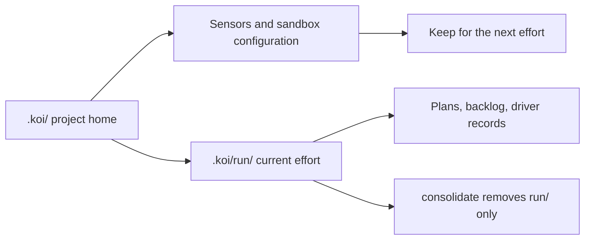
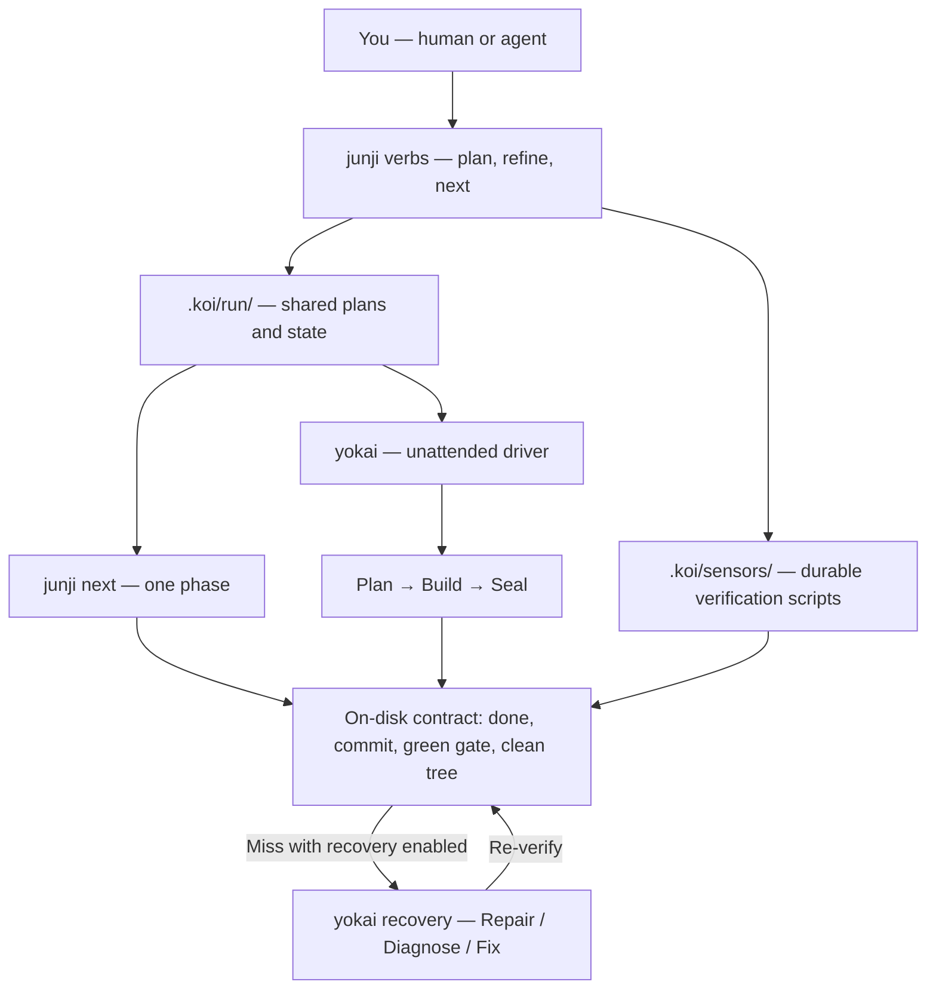

Use koi to carry a large engineering project across coding-agent sessions. It works with your existing repository and agent. Start by preparing the work with Junji, then let Yokai run and verify one phase.

[Run your first phase](/docs/start-here/quickstart). You can return here for the architecture and terminology.

The filesystem is durable memory. The context window is a disposable cache. A large effort becomes an ordered list of small phases. Each phase is verified on disk (a passing gate and a real commit), never from the agent's self-report.

## Pieces

Each piece works alone. Together they run long agent work.

| Piece | What it is |
|-------|------------|
| **junji** | The **method** — a coding-agent skill that runs a big effort from an on-disk working folder |
| **koi** (CLI) | The **setup CLI** — `koi setup` scaffolds the durable project home; `koi init` and `koi doctor` write and check driver config |
| **yokai** (CLI) | The **driver** — a fail-fast supervisor that runs phases through an agent (Plan → Build → Seal, optional recovery) and verifies each one on disk |
| **tori** | The **ACP connector port** yokai uses to talk to coding agents |

State lives under `.koi/` at the repo root, git-committed, one junji project per repo.

## When to use koi

Use koi when the work is too large for one sitting or one context window (ports, migrations, large refactors, greenfield builds) and you want:

- Phases you can verify independently, each with an objective gate: every `.koi/sensors/*.sh` exits 0.
- A durable position on disk so a fresh agent session, or an unattended driver, can pick up without chat history.
- Fail-fast supervision that checks the on-disk contract, not the agent's self-report.

Skip koi for one-off edits, spikes with no verification bar, or work with no automatable sensors.

## Two folders

```
.koi/                    project home — survives consolidate
  sensors/                 atomic *.sh scripts = verification bar (durable)
  sandbox.yml              optional isolation declaration (durable)
  run/                     working folder — consolidate deletes ONLY this
    config.yml             driver prefs (agent, model, recovery, …)
    CONTEXT.md             execution contract (stable)
    PLAN.md                strategy (stable)
    METHOD.md              per-phase how-to (stable)
    BACKLOG.md             living position + phase list
    phases/                one plan per phase (append-only)
```

The **project home** (`.koi/`) holds sensors and sandbox config. The **working folder** (`.koi/run/`) holds plans, the backlog, and driver run prefs. The junji skill owns the markdown convention. The driver owns `config.yml`, `ledger.jsonl`, and artifacts like `FEEDBACK.md`.



The project home survives the end of an effort. Start the next effort with the same sensors and sandbox configuration.

## Six terms

| Term | Meaning |
|------|---------|
| **Phase** | One coherent, independently-verifiable unit of work in the backlog |
| **Sensor** | One script `.koi/sensors/<name>.sh` — single concern, `exit 0` means pass |
| **Gate** | Aggregate verdict: green iff every sensor passes (filename order, fail-fast). Not a file on disk |
| **Contract** | After a phase: backlog `[done]`, new commit, gate green, clean tree — verified by yokai, never self-report |
| **Project home** | Durable `.koi/` (`sensors/`, `sandbox.yml`) — survives `consolidate` |
| **Working folder** | Volatile `.koi/run/` — plans, backlog, driver prefs; `consolidate` deletes only this |

Never weaken a sensor to make the gate pass. Flag irreversible steps with `[gated]`. Bare `yokai` pre-authorizes them. `yokai --guarded` halts instead.

## How the pieces fit



junji is the method. It plans one phase and can execute it through `next` in a single agent session. yokai loops phases unattended and checks the contract after each one. You can stop at junji, or add yokai later. Both read the same `.koi/run/` files.

Bare `yokai` loops until halt or completion. It pre-authorizes gated phases. Use `yokai --guarded` when you want a non-interactive stop before each gated phase.

## Where to go next

| Goal | Start here |
|------|------------|
| Install and run your first project | [Quickstart](/docs/start-here/quickstart) |
| Learn the junji method verb by verb | [junji hub](/docs/junji) → [Guide](/docs/junji/guide) |
| Install or invoke the agent skills | [junji skills reference](/docs/junji/skills) |
| Run phases unattended | [yokai hub](/docs/yokai) → [Run](/docs/yokai/run) |
| Copy a verification script | [Recipes](/recipes) |
| Wire the verification bar | [Sensors](/docs/sensors) |
| Run inside a Linux VM sandbox | [Sandbox overview](/docs/sandbox/overview) |
| Understand Plan → Build → Seal | [Build](/docs/yokai/build) |
| Understand recovery | [Recovery](/docs/yokai/recovery) |
| Deep glossaries and ADRs | [Reference glossaries](/docs/reference/glossaries) and [decision records](/docs/reference/decision-records) |

Precise driver vocabulary: [yokai CONTEXT.md](https://github.com/getkoi/koi/blob/main/crates/yokai/CONTEXT.md). Method vocabulary: [junji CONTEXT.md](https://github.com/getkoi/koi/blob/main/skills/junji/CONTEXT.md).
