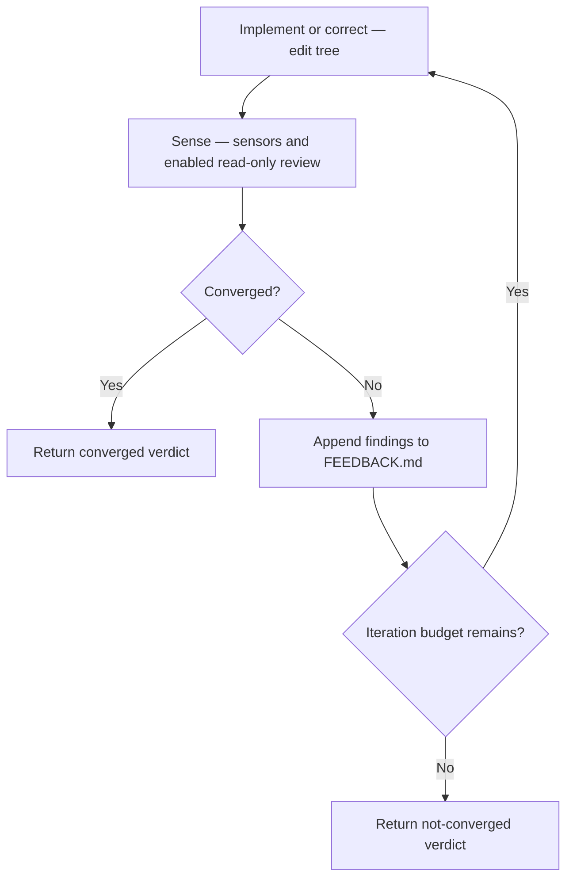
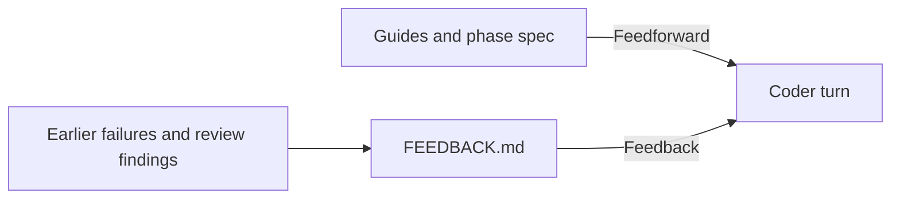
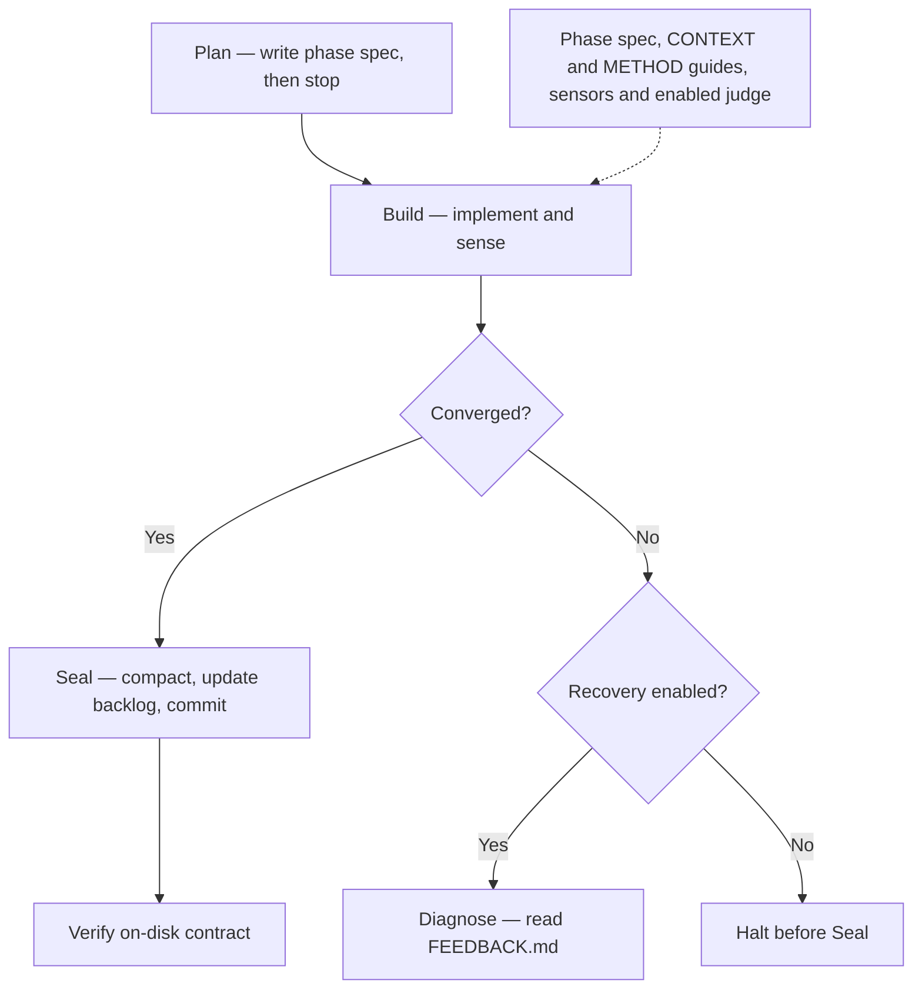

## What the loop is

Build is the self-correction cycle inside each yokai phase: drive a coding agent against **sensors**, using **guides** (feedforward) and a **feedback** thread (`FEEDBACK.md`), then return a **verdict**. It knows nothing of phases, commits, or backlogs. Intelligence lives in the agent and the judge. Yokai only orchestrates turns, sensing, and budget. Agents go through **tori**.

> "Done" is never the loop's word. It returns `converged` or `not-converged`. The on-disk **contract** after Seal is still the arbiter.

Glossary: [crates/yokai/CONTEXT.md](https://github.com/getkoi/koi/blob/main/crates/yokai/CONTEXT.md). ADR: [0039](https://github.com/getkoi/koi/blob/main/crates/yokai/docs/adr/0039-yokai-owns-build-and-recovery.md).

## The loop

One **iteration** is an agent turn (implement or correct) plus a **sensing** pass.
By default each turn starts fresh from the tree, spec, and `FEEDBACK.md`.
With [token savings](/docs/reference/configuration#token-savings), planning, coding and sealing
share a session, corrections return to it, and repeated reviews share a separate session.
See the [context-window diagrams](/docs/reference/configuration#context-windows-with-and-without-token-savings)
for the session lifecycle in both modes.



**Budget:** `max_iters` (omit in `config.yml` for unlimited; `--max-iters` still a positive cap). Exhaustion without convergence means `not-converged`. `0` still means zero iterations.

## Sensors

After every iteration, yokai **senses** the tree. Authoritative sensors are `.koi/sensors/*.sh`. Exit 0 means pass. The aggregate pass is the **gate**. Do not call one script "the gate."

The **judge** is a separate read-only review turn against the spec. It emits JSON findings. It is advisory: blocking findings veto; they never grant a pass. The judge prompt also reads `.koi/run/CONTEXT.md › Skills` for **`judge`** and uses those Must `SKILL.md` files as a rubric ([ADR-0043](https://github.com/getkoi/koi/blob/main/crates/yokai/docs/adr/0043-judge-reads-context-skills.md)). Missing Skills or `none` for judge is a no-op.

```
converged  iff  every AUTHORITATIVE sensor green
                AND no unresolved BLOCKING judge finding
```

| Role | Can grant pass? | Can block pass? |
|------|:---------------:|:---------------:|
| Authoritative sensor | yes | yes |
| Judge blocking finding | never | yes (veto) |
| Judge nit | never | no (informational) |

The judge runs read-only. Yokai alone writes `FEEDBACK.md`. Unparseable judge output is surfaced but does not veto.

## Guides and feedback



- **Guide**. Caller-supplied, static: file reference (`CONTEXT.md`) or inline imperative. Injected **before** the coder acts. Distinct from **Skills** (in-repo `SKILL.md` mapped by role in CONTEXT). The coder prompt also points at Skills for **`coder`**.
- **`FEEDBACK.md`**. Append-only failures and findings. Injected **after** prior iterations failed.

## Verdict

| Value | Meaning |
|-------|---------|
| `converged` | Authoritative sensors green; no blocking judge findings |
| `not-converged` | Budget exhausted |

Reports per-sensor states, judge findings, iterations used. The loop commits nothing and marks nothing.

## Plan → Build → Seal

yokai maps junji `next` to three **acts**:



On convergence, yokai deletes `FEEDBACK.md` before Seal so it is not committed. `verdict.converged` is an **input** to the contract, not a substitute for `[done]` + commit + gate + clean tree.

Tune Build in `.koi/run/config.yml`:

```yaml
build:
  # max_iters: 3      # omit = unlimited
  judge: true
  guides: []          # extra feedforward references
# roles:
#   judge:
#     tier: high      # omit ⇒ phase tag
```

CLI: `yokai --max-iters 3`.

## Swarm (optional)

Use [swarms](/docs/yokai/swarms) to split work among parallel workers and merge their output. Both the run setting and a `[swarm]` phase tag must enable them. Plain phases use one coder.

The swarm guide covers setup, worker limits, review, failures, and interrupted work. For fresh and reused conversations, read [Sessions](/docs/yokai/sessions).

## Vocabulary

| Term | One line |
|------|----------|
| **Loop** | implement → sense → feedback → correct → … |
| **Iteration** | One coder turn + sensing; below a junji **phase** |
| **Sensor** | One `.koi/sensors/*.sh` script; exit 0 means pass |
| **Gate** | Aggregate of authoritative sensors, not one script |
| **Judge** | Read-only review; blocking findings veto only |
| **Guide** | Feedforward before the coder acts |
| **Spec** | Opaque task body. For junji, the phase plan |
| **FEEDBACK.md** | Append-only correction thread; yokai sole writer |
| **Budget** | `max_iters` (or unbounded) |
| **Verdict** | `converged` or `not-converged` |
| **Swarm** | Fan-out each iteration when `swarm.enabled` and the phase is `[swarm]` |

## Four rules

1. **Thin**: yokai edits no product files itself; coder and judge are agent turns.
2. **Gate alone says yes**: only authoritative sensors grant convergence.
3. **Judge only subtracts**: veto or explain; never approve past a red gate.
4. **State on disk**: fresh turns normally read the tree, spec, and `FEEDBACK.md`. Token savings reuses conversations within a phase.

## Next

- [Run](/docs/yokai/run): flags, halt conditions
- [Recovery](/docs/yokai/recovery): when Build does not converge
- [junji guide › next](/docs/junji/guide): human `next` protocol
- [Sensors](/docs/sensors): authoring `.koi/sensors/*.sh`
