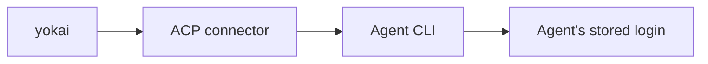

Install and configure the project with the [koi CLI](/koi/docs/cli). Use these flags to launch the yokai driver.

## `yokai`

Fail-fast junji phase driver. Settings: flag → `config.yml` / `sandbox.yml` → default.

```bash
yokai [OPTIONS]
```

| Flag | Config file | Default / notes |
|------|-------------|-----------------|
| `--working-folder <path>` | — | `.koi/run` |
| `--repo <path>` | — | `.` |
| `--agent <name>` | `config.yml` `tiers:` | pin this launch (skip the candidate walk) |
| `--model <id>` | `config.yml` `tiers:` | pin this launch (skip the candidate walk) |
| `--effort <level>` | `config.yml` `tiers:` | pin this launch (skip the candidate walk) |
| `--permission <mode>` | `config.yml` | `approve-all` |
| `--max-iters <n>` | `config.yml` `build.max_iters` | omitted = unlimited |
| `--token-savings` | `config.yml` `token_savings` | reuse planning/implementation, review, and seal sessions per phase; require review; prohibit swarms |
| `--guarded` | — | Halt at each `[gated]` phase (bare `yokai` proceeds) |
| `--once` | — | Run one phase, then exit |
| `--headless` | — | Plain-text stream (also when stdout is not a TTY) |
| `--max-cost <usd>` | — | Run-wide ceiling; unbounded when omitted |
| `--max-tokens <n>` | — | Fallback ceiling when cost unavailable |
| `--theme <hour>` | env `YOKAI_THEME` | `terminal` (default) \| `yoru` \| `hiru` (`yoi` / `asa` alias to `yoru`) |
| `--host` | — | Force local supervisor despite `sandbox.enabled` |

Exit codes: `0` success; `2` halt (headless); preflight failure via `anyhow` (non-zero).

When `sandbox.enabled` and not `--host`, host `yokai` execs an inner supervisor in the VM (sets
`YOKAI_SANDBOX_INNER=1` on the inner process).

### TUI keys (non-headless)

| Key | Action |
|-----|--------|
| `w` | Cycle cockpit → sessions → deliverable |
| `t` | Cycle theme |
| `x` | Abort in-flight phase |
| `q` / `Esc` | Open quit confirmation; `y` confirms and kills the in-flight agent, `n` cancels. In Deliverable patch focus, `Esc` returns to the tree |
## Environment variables

| Variable | Used by | Purpose |
|----------|---------|---------|
| `YOKAI_THEME` | `yokai --theme` | Cockpit theme: `terminal` (default), `yoru`, `hiru` (`yoi` / `asa` alias to `yoru`) |
| `YOKAI_SANDBOX_INNER` | yokai sandbox | Set to `1` or `true` on in-VM supervisor — prevents re-launch |
| `KOI_DATA_DIR` | yokai sandbox launcher | Override `~/.local/share/koi` (Linux harness ELFs) |
| `ANTHROPIC_API_KEY` | claude auth hint | Optional; `doctor` warns when unset (connector may still use `claude auth login`) |
| `CODEX_API_KEY` | codex auth hint | Optional; takes precedence over `OPENAI_API_KEY` for the Codex adapter |
| `OPENAI_API_KEY` | codex auth hint | Fallback API key when `CODEX_API_KEY` is unset |
| `NO_BROWSER` | Codex ACP adapter | Set to `1` to hide ChatGPT browser login in headless/sandbox environments |
| `HOME` | sandbox launcher | Resolves data dir when `KOI_DATA_DIR` unset |

Agent credentials otherwise live inside each agent (e.g. `claude auth login`, OpenCode `/connect`);
there is no separate driver login.
## Agent login

There is no driver login. yokai drives an **agent**; credentials live in the agent's store.



| Agent | Typical login |
|-------|----------------|
| **claude** (default) | `claude auth login`, or `claude setup-token`, or `export ANTHROPIC_API_KEY=…` |
| **cursor** | Cursor CLI credentials (`cursor-agent`) |
| **opencode** | `opencode`, then `/connect` for a provider |
| **codex** | Codex ChatGPT login, or `export CODEX_API_KEY=…` (else `OPENAI_API_KEY`). In sandbox, prefer an API key and `NO_BROWSER=1` |

Check Claude anytime: `claude auth status`. Log in **before** unattended runs. Unauthenticated runs fail fast instead of hanging.
## Develop without installing

From the repo root:

```bash
cargo run -p koi -- setup --yes
cargo run -p koi -- init --yes
cargo run -p koi -- doctor --probe
cargo run -p yokai --
```
## Agents supported today

Native ACP connector drives **`claude`**, **`cursor`**, **`opencode`**, and **`codex`**
([ADR-0003](https://github.com/getkoi/koi/blob/main/crates/yokai/docs/adr/0003-native-acp-connector-only.md)).
gemini and fine-grained policy files are not supported.
