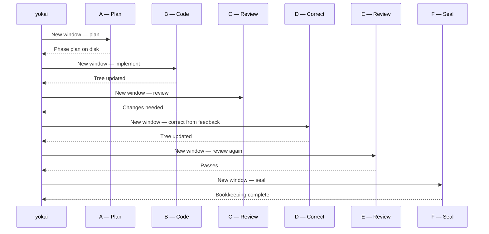
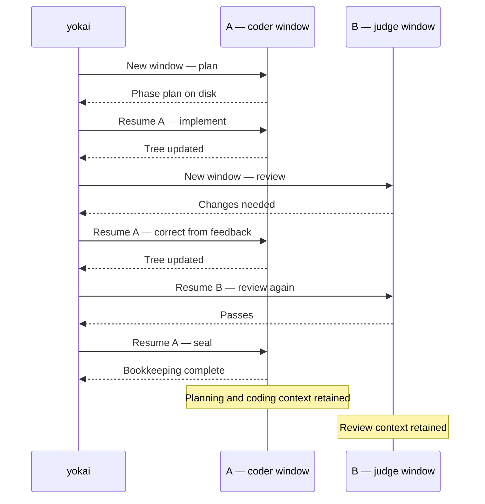

Precedence: CLI flag → committed YAML → built-in default. Project layout: [Project home](/koi/docs/project-home). Sandbox declaration: [sandbox.yml](/yokai/docs/sandbox/sandbox-yml). Sensor scripts: [Sensors](/yokai/docs/sensors).

## `.koi/run/config.yml`

Driver per-project settings. Written by `koi init`; read by `yokai` and `koi doctor`.

| Field | Values | Default when omitted |
|-------|--------|----------------------|
| `tiers` | four ordered candidate lists (`low` / `medium` / `high` / `ultra`) | **required** — missing or empty band → Halt; re-run `koi init` |
| `tiers.retry_after_secs` | seconds | `3600` (cooldown after a skip) |
| `session_options` | map of ACP category/id/name → value | empty (run-global; a candidate's `speed` overlays `fast` for that turn) |
| `agent_timeout_secs` | wall-clock seconds per agent turn | `1800` (30m) |
| `sensor_timeout_secs` | wall-clock seconds per sensor script | `900` (15m) |
| `permission` | `approve-all` \| `approve-reads` \| `deny-all` | `approve-all` |
| `token_savings` | `true` \| `false` | `false`; reuse two conversations per phase, require review, disable swarms |
| `recovery` | `true` \| `false` | `true` (repair + Diagnose cycle + saves) |
| `build` | block (below) | omitted `max_iters` = unlimited; `judge: true`; `guides: []` |
| `roles` | per-slot `tier` lift (below) | omit a slot → phase tag (plan/coder/judge/seal) or **ultra** (repair/fix/triage) |
| `swarm` | block (below) | omitted = off (kill-switch; per-phase `[swarm]` still required) |

Top-level `agent` / `model` / `effort` still deserialize on old files, then Halt if `tiers:` is absent (no legacy synthesize).

### Token savings

Read [Sessions](/yokai/docs/sessions) for the lifecycle and interruption scenarios. Use the settings below to configure that behavior.

Enable `token_savings: true`, select it in `koi init`, or pass `yokai --token-savings`
for one launch. Each phase shares one session for planning, implementation and sealing,
and one for repeated reviews. Corrections return to the implementation
session. Existing phase plans still skip Plan.

The coder profile selects the planning/implementation/sealing session; judge selects
the review session. Recovery diagnosis reuses judge; Fix and bookkeeping Repair reuse
coder. Separate plan, seal and recovery profiles are ignored in this mode;
`recovery: false` still disables recovery. Each conversation keeps its selected
candidate until unavailable or overridden by an explicit launch pin.

Review is required even with `build.judge: false`. Swarms are disabled even with
`swarm.enabled: true` and `[swarm]` tags. Every role is instructed to avoid subagents
and delegation; current ACP adapters have no dedicated delegation switch.

Continuation prompts reuse conversation context and reference the current phase spec
and feedback. Replacement sessions receive full context. Two sessions is the normal
count, not a cap: failed reattachment or explicit context exhaustion can require a
replacement. Adapter compaction remains available. The mode reduces repeated context
loading; it does not guarantee a particular token or price reduction.

#### Context windows with and without token savings

A session owns a context window; a turn is one task inside that conversation.
The diagrams show one phase with a review-requested correction, followed by a
passing review. Letters stand for session IDs, not models. Sensors run between
coding and review but do not open agent sessions.

Without token savings (`token_savings: false`), each completed turn uses a
separate session/window. This example opens six sessions, each loading the
required on-disk context.



With token savings (`token_savings: true`), turns return to two sessions.
A retains planning and coding context through Seal; B retains review context
across repeated reviews. Each agent lifeline below represents one shared context window;
time runs from top to bottom, with yokai dispatching every turn.



Further corrections repeat the same pattern. In token savings, recovery Fix and
Repair also return to A; Diagnose returns to B. Without it, each recovery turn
starts a fresh session. Normal mode can skip review or use configured swarms;
token savings requires review and prohibits swarms and delegation. An existing
phase plan skips the Plan turn in either mode.

These windows are separate: reviewing does not append the judge's conversation
to the coder's window. The driver passes findings through feedback. Within each
session, prompts, replies and tool results consume context; compaction can reduce
occupancy. The [TUI bars](/yokai/docs/tui#context-gauge) show the latest known
occupancy for that session, not the sum of its turn snapshots or lifetime token
spend. All rows with the same session ID therefore share the latest reading.

A new phase starts new sessions. Failed reattachment or explicit context
exhaustion can replace a session, so two is not a hard cap. Interrupted turns
may reattach even without token savings.

**Not in this file:** sandbox (`../sandbox.yml`), launch-only flags, theme, cost/token ceilings.

Example:

```yaml
# .koi/run/config.yml
token_savings: false        # opt in to two reusable conversations per phase
tiers:
  # retry_after_secs: 3600
  low:
    - agent: claude
      model: haiku
  medium:
    - agent: claude
      model: sonnet
    - agent: cursor
      model: composer
      speed: "true"
  high:
    - agent: claude
      model: opus
      effort: high
  ultra:
    - agent: claude
      model: opus
      effort: max
session_options:
  # Mode: agent             # whatever list_session_options advertises
  # fast: "true"            # run-global; a candidate `speed` overlays this for that turn
# agent_timeout_secs: 1800
# sensor_timeout_secs: 900
permission: approve-all
recovery: true              # false = halt immediately on a miss
# Optional per-role band lifts (ADR-0049, amends 0038):
# roles:
#   judge:
#     tier: high
#   triage:
#     tier: ultra           # omitted repair/fix/triage already default to ultra
build:
  # max_iters: 3            # omit = unlimited
  judge: true
#   guides:
#     - docs/style.md
# swarm:                    # omit = off; [swarm] phases still need enabled
#   enabled: true
#   max_workers: 8          # item cap and concurrency
```

A **candidate** is `(agent, model, effort, speed)`. Model, effort, and speed may be omitted (that agent's defaults). Speed is an opaque per-candidate session option, not a koi enum. List order is preference: yokai walks at **turn open**; a skip (`unreachable` / `limited` / `unstable`) records a ledger skip row and tries the next. The next turn starts at the preferred again after `retry_after_secs`. All candidates skipped → Halt. Missing effort/speed is a notice, not a skip.

`koi init` requires at least one candidate on every band. Four ordered multi-selects (Low / Medium / High / Ultra); switch Agent inside a step to mix providers. `koi init --yes` stamps `--agent` / `--model` / `--effort` onto all four bands (one candidate each).

`yokai --agent` / `--model` / `--effort` **pin** this launch and skip the walk.

### `roles:` (ADR-0049, amends 0038)

Optional `tier` lift per slot. Drop role-level `agent` / `model` / `effort`.

| Slot | Omit ⇒ |
|------|--------|
| `plan`, `coder`, `judge`, `seal` | the phase's BACKLOG tier tag |
| `repair`, `fix`, `triage` | **ultra** |

Swarm adds no slot: split walks plan's band; workers and merge walk coder's; judge fan-out walks judge's.

| Rule | Behavior |
|------|----------|
| `roles.<slot>.tier` | must be `low` \| `medium` \| `high` \| `ultra` |
| Unknown role key | hard error (`deny_unknown_fields`) |
| Permission / timeouts / `session_options` | run-global |

`koi init` **Advanced: per-role tier lifts** is opt-in. The cockpit shows the active Agent · Model; a notice when the chosen candidate is not first in the list.

### `swarm:` (ADR-0045, ADR-0047, ADR-0048)

Optional fan-out inside Build (each iteration of a `[swarm]` phase). **Omit the block to leave it off.** `koi init` asks whether
this run may honor `[swarm]` phases, plus the worker cap; `--yes` leaves it omitted.

| Field | Default when omitted |
|-------|----------------------|
| `enabled` | `false` (kill-switch; does not fan out `[plain]` phases) |
| `max_workers` | `8` (item cap **and** concurrency) |

Fan-out runs only when `enabled` is true **and** the live BACKLOG heading is `[swarm]`. `[plain]`
(or a missing tag) stays a single coder. One work item skips the fan-out. There is no `--swarm` flag.
## `.koi/run/config.yml` `build:`

Plan → Build → Seal tuning for every phase. Written by `koi init`; overridable per run with `yokai --max-iters`.

| Field | Default when omitted |
|-------|----------------------|
| `max_iters` | omitted = unlimited (`0` still means zero iterations) |
| `judge` | `true` (advisory review each Build iteration) |
| `judge_model` | **deprecated** — judge walks `roles.judge.tier` (else the phase tag); still parsed for old files |
| `guides` | `[]` — extra feedforward files for the coder |

**Not configurable here:** the gate (authoritative sensors) and the judge's advisory-only role are junji's contract ([ADR-0006](https://github.com/getkoi/koi/blob/main/crates/yokai/docs/adr/0006-tengu-self-correction-harness.md), superseded by [ADR-0039](https://github.com/getkoi/koi/blob/main/crates/yokai/docs/adr/0039-yokai-owns-build-and-recovery.md)). Which candidate runs a turn comes from `tiers:` plus optional `roles.*.tier` ([ADR-0049](https://github.com/getkoi/koi/blob/main/crates/yokai/docs/adr/0049-model-tiers.md)).

If `.koi/run/tengu.yml` is still present, `koi doctor` / yokai preflight **warn**. Move those keys into `build:` and delete the file. yokai does not read it.

Example:

```yaml
# inside .koi/run/config.yml
build:
  # max_iters: 3            # omit = unlimited
  judge: true
#   judge_model: sonnet       # deprecated — use roles.judge.tier
#   guides:
#     - docs/style.md
```
## Runtime artifacts (working folder)

Auto-created files under `.koi/run/`. Removed with `consolidate` unless copied elsewhere first.

| File | Writer | Purpose |
|------|--------|---------|
| `ledger.jsonl` | yokai | Two row kinds: **phase** (cost/gate/commit) and **skip** (cooldown clock). Totals ignore skips. |
| `sessions.jsonl` | yokai | Per-turn session records (Plan, Build iterations, Seal) |
| `session-reuse/` | yokai | Phase-scoped candidate, retained session handle, and usage checkpoints for token savings |
| `RECOVERY.md` | yokai | Index of recovery saves when recovery fires |
| `saves/` | yokai | Episode documents (`0001.md` …) |
| `FEEDBACK.md` | yokai | Build self-correction thread; lives in **working folder** |

**`FEEDBACK.md` location:** under `.koi/run/FEEDBACK.md` during a phase (not repo root). Diagnose reads that path. On convergence, yokai removes it before Seal. On non-convergence it stays for the human or Diagnose.

Copy `ledger.jsonl` and `sessions.jsonl` before `consolidate` if you want the audit trail outside git history.
