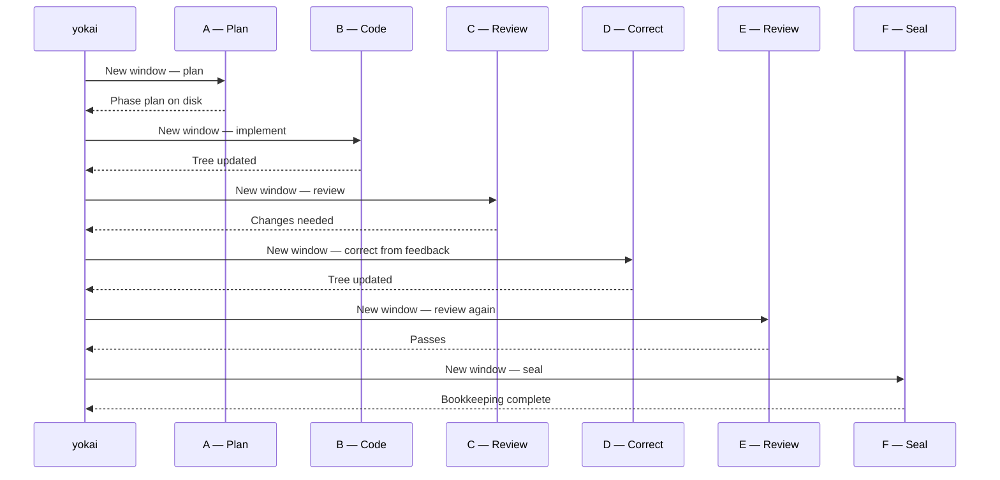
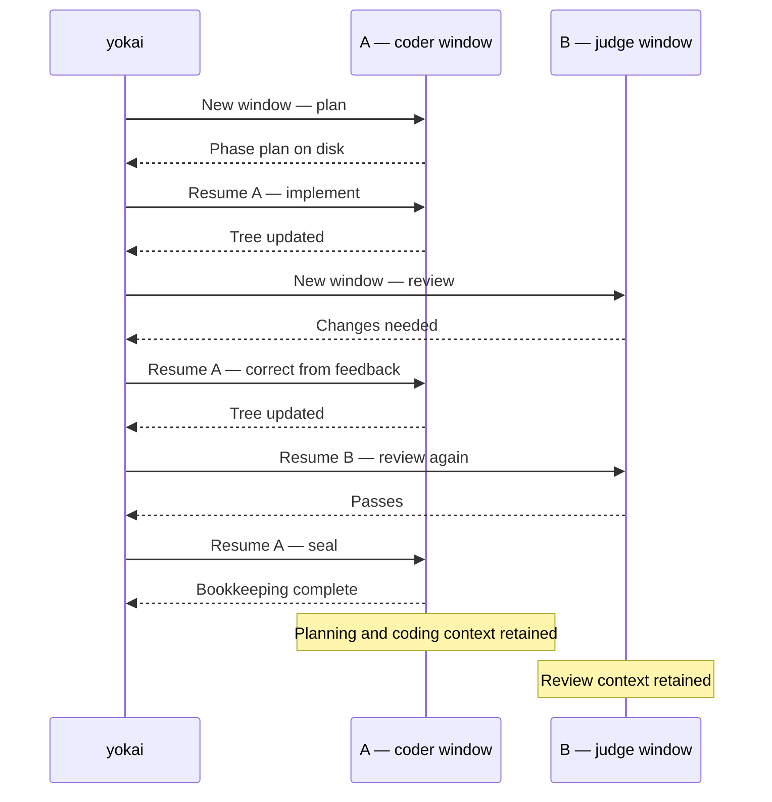

Precedence: explicit CLI flag → `.koi/run/yokai.yml` → durable `.koi/yokai.yml` → built-in default. Project layout: [Project home](/koi/docs/project-home). Sandbox declaration: [Sandbox settings](/yokai/docs/sandbox/sandbox-yml). Sensor scripts: [Sensors](/yokai/docs/sensors).

## `.koi/yokai.yml`

Reusable driver settings (including the nested `sandbox` block). Written by `yokai`; read by `yokai` and `yokai doctor`.

| Field | Values | Default when omitted |
|-------|--------|----------------------|
| `tiers` | four ordered candidate lists (`low` / `medium` / `high` / `ultra`) | omitted bands use the configured agent/model defaults; explicitly empty lists are invalid |
| `tiers.retry_after_secs` | seconds | `3600` (cooldown after a skip) |
| `session_options` | map of ACP category/id/name → value | empty (run-global; a candidate's `speed` overlays `fast` for that turn) |
| `agent_timeout_secs` | wall-clock seconds per agent turn | `1800` (30m) |
| `sensor_timeout_secs` | wall-clock seconds per sensor script | `900` (15m) |
| `permission` | `approve-all` \| `approve-reads` \| `deny-all` | `approve-all` |
| `token_savings` | `true` \| `false` | `false`; reuse two conversations per phase, require review, disable swarms |
| `recovery` | `true` \| `false` | `true` (repair + Diagnose cycle + saves) |
| `build` | block (below) | omitted `max_iters` = unlimited; `judge: true`; `guides: []` |
| `roles` | per-slot `tier` lift (below) | omit a slot → resolved phase tier (plan/coder/judge/seal) or **ultra** (repair/fix/triage) |
| `swarm` | block (below) | omitted = off (kill-switch; per-phase swarm strategy still required) |

Top-level `agent` / `model` / `effort` supply default candidates when a tier band is omitted.

### Token savings

Read [Sessions](/yokai/docs/sessions) for the lifecycle and interruption scenarios. Use the settings below to configure that behavior.

Enable `token_savings: true`, select it in `yokai`, or pass `yokai --token-savings`
for one launch. Each phase shares one session for planning, implementation and sealing,
and one for repeated reviews. Corrections return to the implementation
session. Existing phase plans still skip Plan.

The coder profile selects the planning/implementation/sealing session; judge selects
the review session. Recovery diagnosis reuses judge; Fix and bookkeeping Repair reuse
coder. Separate plan, seal and recovery profiles are ignored in this mode;
`recovery: false` still disables recovery. Each conversation keeps its selected
candidate until unavailable or overridden by an explicit launch pin.

Review is required even with `build.judge: false`. Swarms are disabled even with
`swarm.enabled: true` and swarm assessments. Every role is instructed to avoid subagents
and delegation; current ACP adapters have no dedicated delegation switch.

Continuation prompts reuse conversation context and reference the current phase spec
and feedback. Replacement sessions receive full context. Two sessions is the normal
count, not a cap: failed reattachment or explicit context exhaustion can require a
replacement. Adapter compaction remains available. The mode reduces repeated context
loading; it does not guarantee a particular token or price reduction.

#### Context windows with and without token savings

A session owns a context window; a turn is one task inside that conversation.
The diagrams show one phase with a review-requested correction, followed by a
passing review. Letters stand for session IDs, not models. Sensors run between
coding and review but do not open agent sessions.

Without token savings (`token_savings: false`), each completed turn uses a
separate session/window. This example opens six sessions, each loading the
required on-disk context.



With token savings (`token_savings: true`), turns return to two sessions.
A retains planning and coding context through Seal; B retains review context
across repeated reviews. Each agent lifeline below represents one shared context window;
time runs from top to bottom, with yokai dispatching every turn.



Further corrections repeat the same pattern. In token savings, recovery Fix and
Repair also return to A; Diagnose returns to B. Without it, each recovery turn
starts a fresh session. Normal mode can skip review or use configured swarms;
token savings requires review and prohibits swarms and delegation. An existing
phase plan skips the Plan turn in either mode.

These windows are separate: reviewing does not append the judge's conversation
to the coder's window. The driver passes findings through feedback. Within each
session, prompts, replies and tool results consume context; compaction can reduce
occupancy. The [TUI bars](/yokai/docs/tui#context-gauge) show the latest known
occupancy for that session, not the sum of its turn snapshots or lifetime token
spend. All rows with the same session ID therefore share the latest reading.

A new phase starts new sessions. Failed reattachment or explicit context
exhaustion can replace a session, so two is not a hard cap. Interrupted turns
may reattach even without token savings.

**Not in this file:** launch-only flags, theme and cost/token ceilings. Sandbox settings belong in its `sandbox:` mapping.

Example:

```yaml
# .koi/yokai.yml
token_savings: false        # opt in to two reusable conversations per phase
tiers:
  # retry_after_secs: 3600
  low:
    - agent: claude
      model: haiku
  medium:
    - agent: claude
      model: sonnet
    - agent: cursor
      model: composer
      speed: "true"
  high:
    - agent: claude
      model: opus
      effort: high
  ultra:
    - agent: claude
      model: opus
      effort: max
session_options:
  # Mode: agent             # whatever list_session_options advertises
  # fast: "true"            # run-global; a candidate `speed` overlays this for that turn
# agent_timeout_secs: 1800
# sensor_timeout_secs: 900
permission: approve-all
recovery: true              # false = halt immediately on a miss
# Optional per-role band lifts (ADR-0049, amends 0038):
# roles:
#   judge:
#     tier: high
#   triage:
#     tier: ultra           # omitted repair/fix/triage already default to ultra
build:
  # max_iters: 3            # omit = unlimited
  judge: true
#   guides:
#     - docs/style.md
# swarm:                    # omit = off; swarm assessments still need enabled
#   enabled: true
#   max_workers: 8          # item cap and concurrency
```

A **candidate** is `(agent, model, effort, speed)`. Model, effort, and speed may be omitted (that agent's defaults). Speed is an opaque per-candidate session option, not a koi enum. List order is preference: yokai walks at **turn open**; a skip (`unreachable` / `limited` / `unstable`) records a ledger skip row and tries the next. The next turn starts at the preferred again after `retry_after_secs`. All candidates skipped → Halt. Missing effort/speed is a notice, not a skip.

`yokai` requires at least one candidate on every band. Four ordered multi-selects (Low / Medium / High / Ultra); switch Agent inside a step to mix providers. Headless startup never writes defaults; prepare settings interactively or author the documented configuration explicitly.

`yokai --agent` / `--model` / `--effort` **pin** this launch and skip the walk.

### `roles:` (ADR-0049, amends 0038)

Optional `tier` lift per slot. Drop role-level `agent` / `model` / `effort`.

| Slot | Omit ⇒ |
|------|--------|
| `plan`, `coder`, `judge`, `seal` | the reviewed phase tier |
| `repair`, `fix`, `triage` | **ultra** |

Swarm adds no slot: split walks plan's band; workers and merge walk coder's; judge fan-out walks judge's.

| Rule | Behavior |
|------|----------|
| `roles.<slot>.tier` | must be `low` \| `medium` \| `high` \| `ultra` |
| Unknown role key | hard error (`deny_unknown_fields`) |
| Permission / timeouts / `session_options` | run-global |

`yokai` **Advanced: per-role tier lifts** is opt-in. The cockpit shows the active Agent · Model; a notice when the chosen candidate is not first in the list.

### `swarm:` (ADR-0045, ADR-0047, ADR-0048)

Optional fan-out inside Build (each iteration of a phase assessed as `swarm`). **Omit the block to leave it off.** `yokai` asks whether
this run may honor swarm assessments, plus the worker cap. Reconfiguration preserves fields the wizard does not expose.

| Field | Default when omitted |
|-------|----------------------|
| `enabled` | `false` (kill-switch; does not fan out `[plain]` phases) |
| `max_workers` | `8` (item cap **and** concurrency) |

Fan-out runs only when `enabled` is true **and** the reviewed phase assessment selects `swarm`. `plain`
(or a missing tag) stays a single coder. One work item skips the fan-out. There is no `--swarm` flag.
## `.koi/yokai.yml` `build:`

Plan → Build → Seal tuning for every phase. Written by `yokai`; overridable per run with `yokai --max-iters`.

| Field | Default when omitted |
|-------|----------------------|
| `max_iters` | omitted = unlimited (`0` still means zero iterations) |
| `judge` | `true` (advisory review each Build iteration) |
| `judge_model` | **deprecated** — judge walks `roles.judge.tier` (else the reviewed phase tier); still parsed for old files |
| `guides` | `[]` — extra feedforward files for the coder |

**Not configurable here:** the gate (authoritative sensors) and the judge's advisory-only role are junji's contract ([ADR-0006](https://github.com/getkoi/koi/blob/main/crates/yokai/docs/adr/0006-tengu-self-correction-harness.md), superseded by [ADR-0039](https://github.com/getkoi/koi/blob/main/crates/yokai/docs/adr/0039-yokai-owns-build-and-recovery.md)). Which candidate runs a turn comes from `tiers:` plus optional `roles.*.tier` ([ADR-0049](https://github.com/getkoi/koi/blob/main/crates/yokai/docs/adr/0049-model-tiers.md)).

If `.koi/run/tengu.yml` is still present, `yokai doctor` / yokai preflight **warn**. Move those keys into `build:` and delete the file. yokai does not read it.

Example:

```yaml
# inside .koi/yokai.yml
build:
  # max_iters: 3            # omit = unlimited
  judge: true
#   judge_model: sonnet       # deprecated — use roles.judge.tier
#   guides:
#     - docs/style.md
```
## Runtime artifacts (working folder)

Auto-created files under `.koi/run/`. Removed with `consolidate` unless copied elsewhere first.

| File | Writer | Purpose |
|------|--------|---------|
| `ledger.jsonl` | yokai | Two row kinds: **phase** (cost/gate/commit) and **skip** (cooldown clock). Totals ignore skips. |
| `sessions.jsonl` | yokai | Per-turn session records (Plan, Build iterations, Seal) |
| `session-reuse/` | yokai | Phase-scoped candidate, retained session handle, and usage checkpoints for token savings |
| `RECOVERY.md` | yokai | Index of recovery saves when recovery fires |
| `saves/` | yokai | Episode documents (`0001.md` …) |
| `FEEDBACK.md` | yokai | Build self-correction thread; lives in **working folder** |

**`FEEDBACK.md` location:** under `.koi/run/FEEDBACK.md` during a phase (not repo root). Diagnose reads that path. On convergence, yokai removes it before Seal. On non-convergence it stays for the human or Diagnose.

Copy `ledger.jsonl` and `sessions.jsonl` before `consolidate` if you want the audit trail outside git history.

## Files and precedence

Settings resolve as built-in defaults → `.koi/yokai.yml` → `.koi/run/yokai.yml` → explicit CLI flags.
Each mapping merges recursively, including roles, session options, sandbox settings and tier bands.
Lists replace as a whole, preserving candidate order. `null` clears a value to its built-in default;
`[]` deliberately clears a list such as `build.guides`. A supplied empty tier list is invalid.
An omitted tier band inherits the lower layer, then the built-in candidate.

For example, durable settings:

```yaml
agent: claude
agent_timeout_secs: 2400
sensor_timeout_secs: 1200
permission: approve-all
token_savings: false
build:
  judge: true
  max_iters: 8
  guides: [docs/style.md]
swarm:
  enabled: false
  max_workers: 8
sandbox:
  enabled: false
```

The effort file holds reviewed phase assessments and any effort-specific differences:

```yaml
# .koi/run/yokai.yml
build:
  max_iters: 3
phases:
  P2:
    tier: high
    strategy: plain
    reason: Cross-module state migration with recovery invariants.
```

Save these choices after human approval through the helper or wizard. It inherits durable guides, timeouts and sandbox
preferences. `yokai --max-iters 2` overrides the iteration limit for that launch.
`--token-savings` and `--no-token-savings` override saved token savings in either direction.
`--agent`, `--model` and `--effort` pin the runtime candidate for the launch.
Budgets (`--max-cost`, `--max-tokens`), `--once`, `--headless`, `--host`, `--allow-gated` and theme
remain launch choices.

Optional `tiers` defines `low`, `medium`, `high` and `ultra` ordered candidate lists, plus
`retry_after_secs`. Candidate fields are `agent`, `model`, `effort`, `speed`. `roles.<role>.tier`
can lift a role's tier; roles are plan, coder, judge, seal, triage, repair and fix.
Opaque ACP settings live under `session_options`. Recovery accepts a boolean or its legacy mapping.
Accepted legacy fields survive migration and wizard edits.

The nested `sandbox` mapping accepts `enabled`, `backend` (`docker` or `apple`), `image`, `name`,
`memory` and `cpus`. Enabled sandboxes require a repo-owned image. The Dockerfile and optional
`sandbox-setup.sh` hook remain separate files. `--host` bypasses the sandbox for one invocation.
Smoke checks and readiness run in the selected environment. Sandbox re-entry never onboards.

## Sensor preparation and review

Yokai reads the verification bar, repository instructions, CI and existing project checks in a
read-only agent turn. Each proposed sensor identifies its source command, coverage and prerequisites.
It wraps established commands; it does not invent assertions to satisfy prose. Missing required
checks are reported as gaps and proposed as separate work. They block saving a complete gate.
Commit conventions, historical commits, setup and manual approvals do not become unrelated sensors.

If sensors already exist, the Sensors screen opens them for direct review without an agent turn.
Inspect the existing scripts against the displayed bar, and confirm their command
sources, coverage and prerequisites before choosing Approve and test. Passing smoke checks record
fingerprints without rewriting unchanged scripts. Missing review metadata does not mean sensors are missing. Agent
proposals remain available when checks need changes; headless startup still requires saved review.

Review the exact commands before execution. Yokai validates shell syntax and smoke-runs temporary
copies of every proposed sensor, from the repository root with captured output and process-group cancellation, on the host or
configured sandbox. Scripts must rely on that cwd rather than derive the root from their file path.
Approve and test authorizes saving the complete reviewed gate if every check passes. Failures
require review; no failing gate is saved automatically. Declining review leaves existing sensors intact. Temporary script copies are removed after the review.

All smoke results are reported, including failures. Obvious shell errors, unavailable executables
and timeouts block saving; other failures require explicit classification during review. A legitimate
product-check failure stays intact. Approving a correctly executing but red gate records its review;
it does not make readiness green or allow a phase to complete. Missing dependencies belong in
preparation, not in sensor scripts.

Existing sensors cannot disappear by omission. Removing a wrong-scope, duplicate or obsolete check
requires a specific reason shown during review. Failure alone is never a removal reason.
Replaced and removed originals receive unique hidden `.before-review-*` backups in the sensor
folder, which are not executed. Approval of setup never authorizes a human-gated phase.

The durable `gate_review` mapping in `.koi/yokai.yml` contains `version: 2`, `bar_sha256`, a
`scripts` mapping of filename to SHA-256, and `environment_sha256`. It stores no duplicate script bodies. Changing the
verification section or adding, removing or editing a sensor invalidates review; unrelated CONTEXT
sections do not. The driver rechecks this binding during execution. The environment fingerprint
binds host/sandbox, backend, selected image, Dockerfile and setup-hook contents. An environment
change requires re-smoke and approval of the existing gate, without regeneration. Rebuilds invalidate
environment approval before changing the image, including mutable-tag rebuilds. The helper and
wizard share the exact metadata contract in framework ADR-0010. Use the helper's metadata calculator
after smoke and human approval; never fabricate approval or refresh fingerprints to bypass review.

## Phase assessment

`/yokai assess` and the wizard’s Phase assessment screen propose a model-capability tier and Build strategy for
each unfinished BACKLOG phase. Low fits mechanical edits; medium fits bounded implementation;
high fits substantial cross-module reasoning; ultra is for unusually difficult, tightly coupled work.
Use plain by default. Swarm needs independently mergeable work with clear ownership and integration
checks; a long task alone is not enough. `swarm.enabled: false` or token savings still forces plain.

Review `phases.<ID>.tier`, `strategy` and a short `reason` before saving `.koi/run/yokai.yml`.
Approval through the helper skill is sufficient: complete saved choices are authoritative. Startup
does not request a second approval, agent proposal or assessment fingerprint. Junji alone does not
require the mapping. YAML choices override optional legacy heading tags and stay out of plan Markdown.

Interactive setup proposes missing or incomplete assessments. Existing complete choices remain in
use after status, plan or scope edits. Reconsider them with `/yokai assess` or the cockpit’s Prepare menu
when scope changes warrant different choices; Yokai does not infer staleness from hashes. Explicit
CLI assessment can review existing values without an agent and preserves unrelated settings.
New phases need complete entries; removed or renumbered IDs require mapping cleanup.

Headless startup and sandbox re-entry stop only for invalid, missing or incomplete mappings, never
for missing assessment approval metadata. Old `reviewed_sha256` fields are accepted but ignored and
omitted on explicit assessment saves; startup does not rewrite them. Assessment never authorizes
`[gated]` work: `--allow-gated` remains a separate launch choice subject to standing directives.

## Migrate an existing installation

The Koi binary has been removed without a compatibility wrapper. Replace `koi setup` / `koi init`
with interactive `yokai`, and `koi doctor` with `yokai doctor`.

```bash
yokai migrate
```

This validates `.koi/run/config.yml` and `.koi/sandbox.yml`, moves reusable values to `.koi/yokai.yml`,
and retains byte-for-byte originals as `config.yml.legacy` and `sandbox.yml.legacy`.
Unreadable files, malformed YAML and unknown settings are errors, not defaults.

If legacy settings conflict with durable or effort settings, migration lists the field paths and
makes no settings changes. Reconcile them manually or explicitly choose a side:

```bash
yokai migrate --prefer legacy
# or
yokai migrate --prefer new
```

The choice resolves settings collisions only; other fields survive. Choosing legacy also resolves
colliding effort values. Writes are atomic per destination; originals remain recoverable and retrying
after interruption accepts identical backups. A different backup is never overwritten.

Migration then converts `.koi/gate-review.yml` into compact durable metadata only if the receipt
exactly matches the current bar and scripts and does not conflict with existing metadata. It removes
the old receipt after a successful write. A stale or conflicting receipt is retained and reported;
`--prefer` cannot approve changed checks. Reconcile through `yokai`. Ordinary headless
startup never migrates; interactive startup offers migration. Review and commit the resulting files.

Migration leaves active plans, customized METHOD/CONTEXT, progress and sensors unchanged. It does
not manufacture phase assessments; open Phase assessment in `yokai` for an existing effort.
To adopt new method templates, merge relevant prose deliberately, preserving custom sections and
standing directives. `begin` never overwrites an active backlog or customized method.

`consolidate` removes all of `.koi/run/`: assessments, effort differences, session handles, ledgers,
recovery and budget accounting. It preserves everything else under `.koi/`. The next effort inherits
reusable settings but needs its own phase assessment and starts new accounting. Junji's free workflow
and this convention do not depend on private Yokai implementation code; licensing changes are separate.

Legacy gate migration retains exact content-review evidence but cannot prove the smoke environment.
Version-1 metadata therefore requires one environment smoke review in the wizard or helper.
It never silently approves changed checks or upgrades unproven environment metadata.
