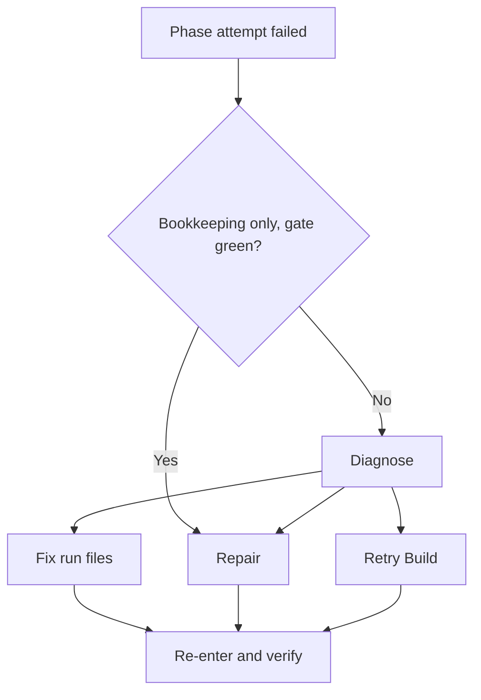

Yokai retries failed work automatically. Leave recovery enabled to let it diagnose a failed Build or repair unfinished bookkeeping. Watch the recovery activity in the [TUI](/yokai/docs/tui); use [troubleshooting](/yokai/docs/troubleshooting) if the run stops.

Repair handles bookkeeping when the gate is already green. Diagnose reads the failure and chooses another Build attempt, Repair, or Fix. Fix changes run files and sensors; Build changes product code. Recovery keeps the same verification requirements.

Default is **on**. `recovery: false` is fail-fast: Halt immediately on a contract or Build miss. Cycles and saves are unlimited; `--max-cost` / `--max-tokens` (if set), user abort, and `--guarded` still Halt. Diagnose cannot Halt: an unreadable decision grants a full Budget Build.

Each episode is a **save** under `.koi/run/saves/`. `RECOVERY.md` is a short index. Both live in the working folder and are removed with `consolidate`.

## Config

In `.koi/yokai.yml`:

```yaml
recovery: true    # default when omitted
```

<details>
<summary>Compatibility and recovery model tiers</summary>

Legacy nested maps (`repair` / `triage` / `max_grants`) still parse: all-off → `false`; any other mapping → `true`. New writes are the boolean.

Diagnose (triage), Repair, and Fix omit ⇒ **ultra**. Lift with `roles.triage.tier` / `roles.repair.tier` /
`roles.fix.tier` if you want a cheaper band.

</details>

## Cycle

1. **First no-progress** is still a blind Retry. The **second** consecutive miss (stall) enters recovery when it is on.
2. Green gate and unfinished bookkeeping (including **transcription**: commit exists, phase unmarked) → one **repair** turn, then re-verify. Unresolved → Diagnose.
3. Otherwise **Diagnose** (read-only) names `fix`, `repair`, or `grant_build`.
4. **Fix** may edit `.koi/` run + sensors, repo `.gitignore`, backlog/phase files. Product code is for Build.
5. **Put-back:** re-verify; if not Advanced, grant a full-Budget Build (skip Plan) or another repair. Granted Build looks like normal Build in the TUI.



Repair that does not resolve the failure leads to Diagnose. Re-entry checks the same phase contract. Budget ceilings and user stops still apply throughout.

## On-disk artifacts

| File | Role |
|------|------|
| `.koi/run/FEEDBACK.md` | Build scratch; yokai is the sole writer; removed on convergence before Seal |
| `.koi/run/saves/NNNN.md` | episode body (repair, diagnose, fix, put-back) |
| `.koi/run/RECOVERY.md` | index of saves |
| `.koi/run/ledger.jsonl` | per-phase audit including recovery rows |

## Quick lookup

| Situation | `recovery: true` | `recovery: false` |
|-----------|------------------|-------------------|
| stall / gate red / Build non-converge | Diagnose cycle (repair first if repairable) | Halt immediately |
| gate green, dirty tree or unmarked + commit | one repair turn, then Diagnose if still open | Halt immediately |
| Diagnose JSON unreadable | grant Build | — |
| cost/token ceiling, abort, `--guarded` | Halt | Halt |

## Related

- [Run](/yokai/docs/run): `--max-cost`, halt conditions
- [Build loop](/yokai/docs/build): iterations, judge, `FEEDBACK.md`
- [Troubleshooting](/yokai/docs/troubleshooting): recovery symptom rows
- Driver ADR: [0044](https://github.com/getkoi/koi/blob/main/crates/yokai/docs/adr/0044-recovery-continue-and-saves.md) (amends [0010](https://github.com/getkoi/koi/blob/main/crates/yokai/docs/adr/0010-recovery-last-look-before-halt.md))
