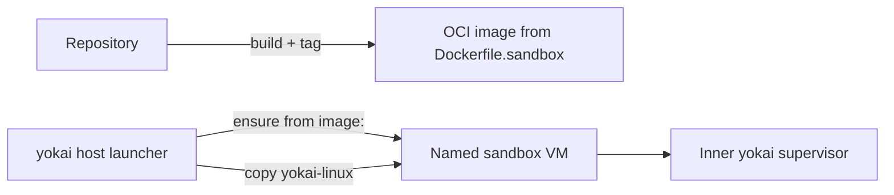

Run Yokai in a Linux VM when your project needs a reproducible environment. Enable the sandbox in the `sandbox` mapping in `.koi/yokai.yml` and declare the image to use. Yokai creates or reuses the named VM, copies the Linux harness binaries, runs the optional setup hook once, and starts the supervisor inside it.

How the launcher starts the supervisor

The host uses the declared OCI `image:` and copies Linux `yokai` and `koi` binaries into the VM. It runs `.koi/sandbox-setup.sh` once when present. The inner supervisor receives `YOKAI_SANDBOX_INNER=1` so it does not launch another sandbox. See [ADR-0024](https://github.com/getkoi/koi/blob/main/crates/yokai/docs/adr/0024-apple-container-sandbox-backend.md) and [ADR-0027](https://github.com/getkoi/koi/blob/main/crates/yokai/docs/adr/0027-repo-owned-sandbox-image.md).

The repository owns the OCI image (coding agent + gate tools baked in via `.koi/Dockerfile.sandbox`). koi does not ship a framework image catalog. Copy-ready `yokai.yml` + `Dockerfile.sandbox` pairs live at [/yokai/recipes](/yokai/recipes#sandboxes).

Sandbox files live in **project home** and survive `/junji consolidate`. Driver prefs stay in `.koi/yokai.yml`. There is no `sandbox:` block there. Layout: [Start here](/koi/docs).

## Backends

| Backend | Host tooling | Build image with | Agent auth (typical) |
|---------|--------------|------------------|----------------------|
| **Host** (`enabled: false`) | none | n/a | Host agent login |
| **`docker`** (default) | Docker Desktop + `sbx` | `docker build -f .koi/Dockerfile.sandbox …` | Host via `sbx login` / `sbx secret` when configured |
| **`apple`** | Apple Container (`container` CLI) | `container build -f .koi/Dockerfile.sandbox …` | **In-VM** once (e.g. `opencode` → `/connect`) |

Walkthrough: [Launch a sandbox](/yokai/docs/sandbox/launch).

## What sandboxing does not guarantee

Sandbox mode puts the inner supervisor, agent, and gate in a Linux VM with a **direct read-write repo bind mount** at the same absolute path. koi does not promise:

- **Network isolation.** The VM may reach the network for agent APIs, package installs, and gate tools.
- **Filesystem isolation from the host.** Changes in the VM are changes on the host checkout.
- **Credential containment on Apple.** Auth stays in-VM; there is no `sbx secret` parity in v1.
- **Protection from a malicious agent.** The safety model remains the **gate** plus **git** contract checks, not VM hardening.

Use sandbox mode for a reproducible Linux gate environment and co-located agent runs, not as a security sandbox.

## Where to go next

| Doc | Topic |
|-----|--------|
| [Launch](/yokai/docs/sandbox/launch) | Enable, build, first run, recreate (Apple and Docker) |
| [Sandbox settings and image](/yokai/docs/sandbox/sandbox-yml) | Declaration fields, Dockerfile USER rules, agent bake |
| [Host & escape](/yokai/docs/sandbox/host-and-escape) | `--host`, setup marker, mount, artifacts |
| [Troubleshooting](/yokai/docs/troubleshooting) | Symptom → fix |
| [Quickstart](/koi/docs/quickstart) | Host-first first run |
| [Sensors](/yokai/docs/sensors) | Gate scripts the inner run needs in the image |

Decision records: [ADRs](/yokai/docs/decisions) (0024, 0026, 0027, 0028, 0032).
