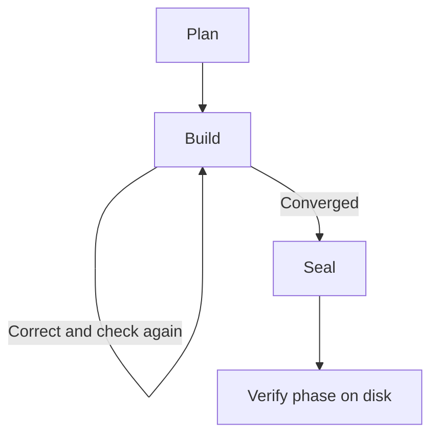
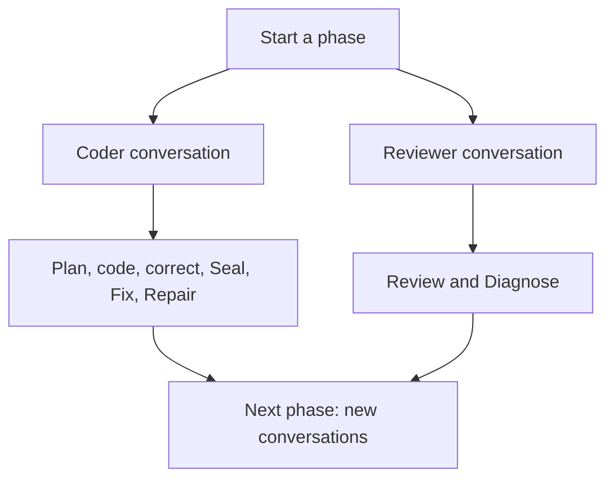

A session is a conversation with your coding agent. Yokai can start a new conversation for each turn or reuse context within a phase. Your plans and progress remain on disk in either mode.

## Follow one phase

A **phase** is one item in the backlog. It runs through Plan, Build, and Seal. Build may need several **iterations**: implement a change, run sensors, and review the result. A **turn** is one request to an agent. A session can contain one turn or several.

Sensors are shell scripts. They do not open agent sessions. When enabled, review starts after the authoritative sensors pass. With review disabled, passing sensors can lead directly to Seal. Build convergence leads to Seal; the phase is complete only after Yokai verifies the backlog, commit, gate, and clean tree.

## Use fresh sessions by default

A completed turn normally ends its session. The next turn reads the tree, phase plan, guides, and feedback from disk. A failed sensor or blocking review finding goes into `FEEDBACK.md`, which guides the next correction.

This is the default for plain phases. You do not need to enable it.

## Reuse context with token savings

Run `yokai --token-savings` to reuse conversations within each phase. For a persistent setting, use [token savings configuration](/docs/reference/configuration#token-savings).

Review is required in this mode. Swarms are disabled, and prompts prohibit delegation. Two conversations per phase is the normal pattern, not a hard limit: failed reattachment or explicit context exhaustion can require a replacement session.

Use [swarms](/docs/yokai/swarms) when you want parallel workers. Use token savings when you want to retain context between turns instead.

## Continue after an interruption

Relaunch Yokai against the same working folder. A phase marked `[building]` resumes Build; `[sealing]` resumes Seal. An existing unique phase plan lets Yokai skip Plan.

An interrupted turn may reattach to its live session even when token savings is off. Reattaching an unfinished turn and reusing a conversation across completed turns are separate behaviors.

Swarm continuation also checks saved work items and worker records. See [continue a swarm](/docs/yokai/swarms#continue-an-interrupted-swarm).

## Inspect what happened

Use the [TUI sessions view](/docs/yokai/tui) or inspect `.koi/run/sessions.jsonl`. The file records turns. Several rows can share a session ID, so its row count is not a count of unique conversations.

For exact session settings and the existing context-window diagrams, see [configuration](/docs/reference/configuration#context-windows-with-and-without-token-savings). If the run cannot advance, see [recovery](/docs/yokai/recovery).
