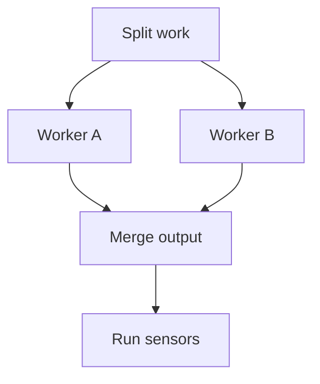

Use swarms to run independent work items in parallel within one phase. Yokai splits the work, runs workers, and merges their output. Parallel work can shorten a run, but splitting and merging add token use. Start with a [plain run](/koi/docs/quickstart) before enabling them.

## Enable swarms

Use `koi init` to allow swarms and choose a worker cap, or edit the `swarm` settings in [configuration](/yokai/docs/configuration). Swarms are off when omitted. The default worker cap is 8.

Both conditions must hold: `swarm.enabled` is true and the current phase has a `[swarm]` tag. Junji `refine` writes a `[plain]` or `[swarm]` strategy on each phase heading.

A `[plain]` phase or an older heading without a strategy stays plain. If a phase says `[swarm]` but swarms are disabled, Yokai reports that and runs plain. Token savings disables swarms. There is no `--swarm` flag, and `/junji next` does not fan out workers.

## Follow the work

When sensors pass, review can use the same split, worker, and merge pattern. Review workers inspect different aspects of the diff, and review merge combines their findings. Blocking findings feed the next iteration; a passing result leads to Seal.

Workers write under `.koi/run/swarm/`. Merge is the only swarm implementation step that writes the product tree. Review workers inspect the current diff by aspect.

Each later Build iteration splits again. Implementation splits focus on work remaining in `FEEDBACK.md`; review splits assess the current diff. A split with one item skips parallel workers and uses a single coder or judge.

## Handle limits and failures

The worker cap limits both item count and concurrency. An oversized or unreadable item list from a new split, or a worker error, returns a non-converged result. Yokai does not partially merge successful workers after a worker failure. [Recovery](/yokai/docs/recovery) governs what happens next.

Cost and token ceilings still stop the run. Nested swarms are forbidden.

## Continue an interrupted swarm

Quit or abort cancels active workers and retains `items.json`. An invalid retained item list triggers a fresh split. When you continue at loop entry, Yokai can reuse a valid item list, skip workers with successful session records, and resume or retry unfinished workers before merging.

A later iteration within the same process starts a new split. A new split clears leftover scratch. Yokai also removes scratch for that kind after a successful merge or a one-item fallback.

How swarm roles use model tiers

Splitting uses the plan band. Implementation workers and merge use the coder band. Review workers and their merge use the judge band. Swarms add no role slots.

Scratch is excluded from the dirty-tree check. Each unfinished worker has a `live-session.json` record under its scratch directory for continuation.

## Next

- [Sessions](/yokai/docs/sessions): fresh conversations, reused context, and reattachment.
- [Build loop](/yokai/docs/build): sensors, review findings, and convergence.
- [TUI](/yokai/docs/tui): watch workers and inspect their turns.
